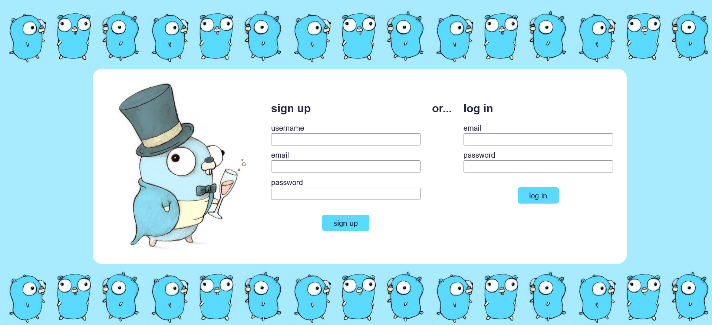
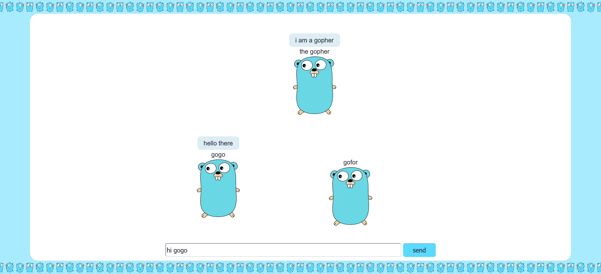

# Go Chatroom

Client deployed on Render at https://go-chat-frontend-1x27.onrender.com/

Server currently deployed on Render at https://go-chat-backend-8jic.onrender.com

Server previously deployed on AWS Elastic Beanstalk (taken down because of high costs).

Navigate to the link above and create an account.
(The layout breaks on Firefox, so I recommend Firefox Nightly or Chrome)
If there are other users online, they will appear on the screen represented as
little blue gophers. Messages they send will appear above their heads. Use the
message box at the bottom of the screen to boardcast a message to everyone.
Messages are not saved, so they disappear after a few seconds, making the
experience closer to talking in-person.

I had two goals for this project:

1. learn a new programming language. I chose Go because it has been increasing
   in popularity and it seemed somewhat different from other programming languages
   I know.
2. deploy an application on AWS / a similar cloud platform. Previously my only
   deployment experience was in Render.

_Login page. Note that I have made small styling changes since this screenshot was taken_

_chat page_

## If deploying on AWS

1. Install certbot with `sudo dnf install certbot`

## How to run locally

### Server

1. Create a local Postgres database. Tables will be created automatically when first running the program.
2. Generate a secret key for signing JWTs, or enter a random string (not secure).
3. Duplicate `.env.template` and rename it to `.env`. Fill in the values.
4. You may have to change the go version on line 3 of `go.mod` to the version installed on your system
5. `cd server`
6. Run `go run ./cmd/`

### Client

1. Edit `client\consts.js` with your server host and/or port, and change SECURE to false
2. Install the Live Server extension for VSCode
3. Start the server
4. Open a browser (not Firefox, but Firefox Nightly is ok) and navigate to 127.0.0.1:5500/client

## Technical details

### Server

A websocket server that enables bidirectional communication.
Uses the Gin framework to handle HTTP/HTTPS requests.
CORS is configured to accept connections from the client on Render.
Everything is authenticated using JWT.

It used to connect to a Postgres database through GORM, a Go ORM,
but I have commented this out to lower hosting costs.
It now uses a map of users instead, which violates REST principles (statelessness).
This means that users are not saved if the server restarts.

### Client

A minimal HTML + JavaScript client.
The layout used to break on Firefox but I believe it works now.
If it breaks on your Firefox use a different browser.
Error checking and reporting especially in the client is a work in progress.

## Authors

Miruna Palaghean

## Acknowledgments

### Documentation

- [The Go Programming Language Specification](https://go.dev/ref/spec)
- [Effective Go](https://go.dev/doc/effective_go)
- [How to Write Go Code](https://go.dev/doc/code)
- [GORM](https://gorm.io/docs/index.html)
- [golang-jwt](https://golang-jwt.github.io/jwt/usage/create/)
- [CSS: Cascading Style Sheets](https://developer.mozilla.org/en-US/docs/Web/CSS)

### Tutorials

- [Get started with Go](https://go.dev/doc/tutorial/getting-started)
- [Routing (using gorilla/mux)](https://gowebexamples.com/routes-using-gorilla-mux/)
- [Developing a RESTful API with Go and Gin](https://go.dev/doc/tutorial/web-service-gin)
- [Gin Custom Middleware](https://gin-gonic.com/docs/examples/custom-middleware/)
- [Password Hashing](https://gowebexamples.com/password-hashing/)
- [Connecting to PostgreSQL using GORM](https://dev.to/karanpratapsingh/connecting-to-postgresql-using-gorm-24fj)
- [coder/websocket chat example](https://github.com/coder/websocket/blob/master/internal/examples/chat/chat.go)
- [CSS Flexbox Layout Guide](https://css-tricks.com/snippets/css/a-guide-to-flexbox/)
- [Create a JavaScript AJAX Post Request](https://code.tutsplus.com/create-a-javascript-ajax-post-request-with-and-without-jquery--cms-39195a)
- [Writing WebSocket client applications](https://developer.mozilla.org/en-US/docs/Web/API/WebSockets_API/Writing_WebSocket_client_applications)

### Deployment tutorials / documentation

- [QuickStart: Deploy a Go application to Elastic Beanstalk](https://docs.aws.amazon.com/elasticbeanstalk/latest/dg/go-quickstart.html)
- [Using the Elastic Beanstalk Go platform](https://docs.aws.amazon.com/elasticbeanstalk/latest/dg/go-environment.html)
- [Buildfile and Procfile](https://docs.aws.amazon.com/elasticbeanstalk/latest/dg/platforms-linux-extend.build-proc.html)
- [Adding a database to your Elastic Beanstalk environment](https://docs.aws.amazon.com/elasticbeanstalk/latest/dg/using-features.managing.db.html)
- [Platform hooks](https://docs.aws.amazon.com/elasticbeanstalk/latest/dg/platforms-linux-extend.hooks.html)
- [Using psql to connect to your RDS for PostgreSQL DB instance](https://docs.aws.amazon.com/AmazonRDS/latest/UserGuide/USER_ConnectToPostgreSQLInstance.html#USER_ConnectToPostgreSQLInstance.psql)
- [Certbot Instructions](https://certbot.eff.org/instructions?ws=nginx&os=snap)

### Other

- various online sources that i glanced at briefly, linked in the code where they were used

### Image sources

- https://go.dev/blog/gophergala
- https://go.dev/blog/gopher
- https://github.com/golang-samples/gopher-vector
