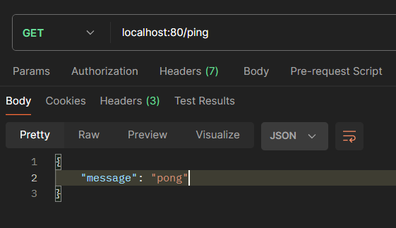
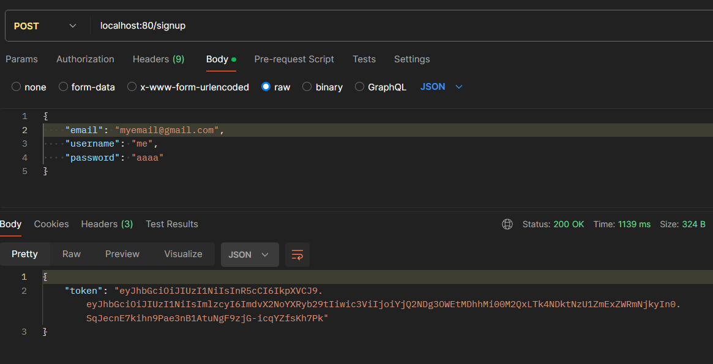
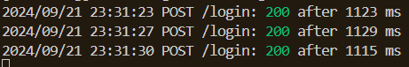
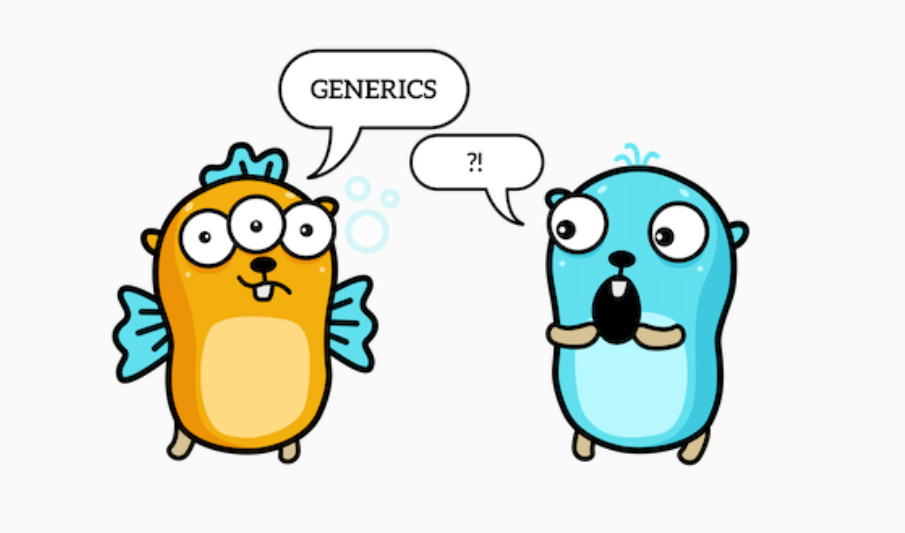

# Go Chatroom

Client deployed on Render at https://go-chat-frontend-1x27.onrender.com/
Server deployment is pending. I may or may not succeed in deploying after the
assignment is submitted.

Navigate to the link above and create an account.
(The layout breaks on Firefox, so I recommend Firefox Nightly or Chrome)
If there are other users online, they will appear on the screen represented as
little blue gophers. Messages they send will appear above their heads. Use the
message box at the bottom of the screen to boardcast a message to everyone.

## What you built?

I had two goals for this assignment:

1. learn a new programming language. I chose Go because it has been increasing
   in popularity and it seemed somewhat different from other programming languages
   I know.
2. deploy an application on AWS / a similar cloud platform. Previously my only
   deployment experience was in Render.

I built a simple chatroom application. Users can create an account and join the
chatroom and communicate in real time with other users. Messages are not saved,
so they disappear after a few seconds, making the experience closer to talking
in-person.

### Server

The focus of this project was the Go backend - a websocket server that enables
bidirectional communication. It connects to a Postgres database that holds
accounts.

_First ping_

_Signup worked on the first try! Go linting is pretty good_

_Custom logger middleware output_

### Client

A minimal HTML+JavaScript client designed to connect to the server.

_Login page. Note that I have made small styling changes since this screenshot was taken_

_chat page_

## How to run locally

### Server

1. Create a local Postgres database. Tables will be created automatically when first running the program.
2. Generate a secret key for signing JWTs, or enter a random string (not secure).
3. Duplicate `.env.template` and rename it to `.env`. Fill in the values.
4. You may have to change the go version on line 3 of `go.mod` to the version installed on your system
5. `cd server`
6. Run `go run ./cmd/`

### Client

1. Edit `client\consts.js` with your server host and port
2. Install the Live Server extension for VSCode
3. Start the server
4. Open a browser (not Firefox, but Firefox Nightly is ok) and navigate to 127.0.0.1:5500/client

## Who Did What?

I did everything. (see Acknowledgments section for links to tutorials)

## What you learned

I learned:

- the module / package structure of Go projects and how to import files
- generic functions and type parameters in Go
- error checking in Go, how to create custom errors, handling different error types
- Go structs and interfaces and how they can be used to mimic OOP
- working with pointers in Go
- deferring functions to clean up / close resources before returning / panicking
- log.Fatal() isn't like console.error() like i first assumed. it exits the program...
- how to create REST routes and middleware using Gin
- GORM, a GO ORM
- how to combine http and websocket in a single app
- how to create a complex websocket server with multiple subscribers that don't
  all communicate to each other (not currently used)
- how to authenticate requests sent over websockets
- how to color console output
- how to store jwt in a cookie using javascript

What worked:

- everything, eventually

What didn't work:

- I initially tried gorilla/mux, but that was more difficult to use so I switched to Gin.
- originally I tried to have multiple group chatrooms, but that got complicated.
- then i implemented direct messages between two users, but didn't implement the UI for it.
- error checking and reporting in the client is not as robust as it should be, i prioritized making it work
- the design of the login page isn't responsive (it breaks if the window is resized)
- for some reason the layout breaks on Firefox (but not on Firefox Nightly)
- I had difficulty setting up the formatter provided by the VS Code Go extension.
- staticcheck keeps saying functions defined in a different file in the same package are undefined...
- adding debugging logs in go can be difficult (i couldn't log the request body to the console)
- I made my AWS account more than a year ago so my free tier expired.
- I tried signing up for Github Student for potential free deployment, but they still haven't processed my application.
- I signed up for Mogenius because they promised free deployment but it was a lie.
- I made an Oracle Cloud account because they promised a free database but they thought I gave them false information (?).
- I tried to deoploy to AWS Elastic Beanstalk ~23 times (i lost count) and each time it failed for a different reason. The current issue is that pinging returns 502 Bad Gateway.

## Authors

Miruna Palaghean

## Acknowledgments

### Documentation

- [The Go Programming Language Specification](https://go.dev/ref/spec)
- [Effective Go](https://go.dev/doc/effective_go)
- [How to Write Go Code](https://go.dev/doc/code)
- [GORM](https://gorm.io/docs/index.html)
- [golang-jwt](https://golang-jwt.github.io/jwt/usage/create/)
- [CSS: Cascading Style Sheets](https://developer.mozilla.org/en-US/docs/Web/CSS)

### Tutorials

- [Get started with Go](https://go.dev/doc/tutorial/getting-started)
- [Routing (using gorilla/mux)](https://gowebexamples.com/routes-using-gorilla-mux/)
- [Developing a RESTful API with Go and Gin](https://go.dev/doc/tutorial/web-service-gin)
- [Gin Custom Middleware](https://gin-gonic.com/docs/examples/custom-middleware/)
- [Password Hashing](https://gowebexamples.com/password-hashing/)
- [Connecting to PostgreSQL using GORM](https://dev.to/karanpratapsingh/connecting-to-postgresql-using-gorm-24fj)
- [coder/websocket chat example](https://github.com/coder/websocket/blob/master/internal/examples/chat/chat.go)
- [CSS Flexbox Layout Guide](https://css-tricks.com/snippets/css/a-guide-to-flexbox/)
- [Create a JavaScript AJAX Post Request](https://code.tutsplus.com/create-a-javascript-ajax-post-request-with-and-without-jquery--cms-39195a)
- [Writing WebSocket client applications](https://developer.mozilla.org/en-US/docs/Web/API/WebSockets_API/Writing_WebSocket_client_applications)

### Deployment tutorials / documentation

- [QuickStart: Deploy a Go application to Elastic Beanstalk](https://docs.aws.amazon.com/elasticbeanstalk/latest/dg/go-quickstart.html)
- [Using the Elastic Beanstalk Go platform](https://docs.aws.amazon.com/elasticbeanstalk/latest/dg/go-environment.html)
- [Buildfile and Procfile](https://docs.aws.amazon.com/elasticbeanstalk/latest/dg/platforms-linux-extend.build-proc.html)
- [Adding a database to your Elastic Beanstalk environment](https://docs.aws.amazon.com/elasticbeanstalk/latest/dg/using-features.managing.db.html)
- [Platform hooks](https://docs.aws.amazon.com/elasticbeanstalk/latest/dg/platforms-linux-extend.hooks.html)
- [Using psql to connect to your RDS for PostgreSQL DB instance](https://docs.aws.amazon.com/AmazonRDS/latest/UserGuide/USER_ConnectToPostgreSQLInstance.html#USER_ConnectToPostgreSQLInstance.psql)

### Other

- various online sources that i glanced at briefly, linked in the code where they were used

### Image sources

- https://go.dev/blog/gophergala
- https://bitfieldconsulting.com/posts/type-parameters
- https://go.dev/blog/gopher
- https://github.com/golang-samples/gopher-vector
